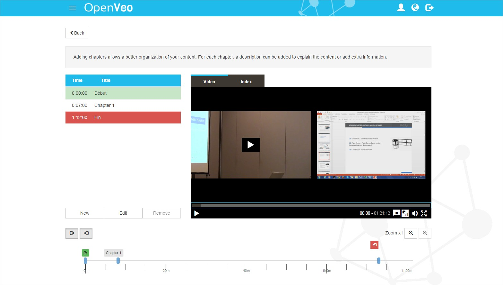
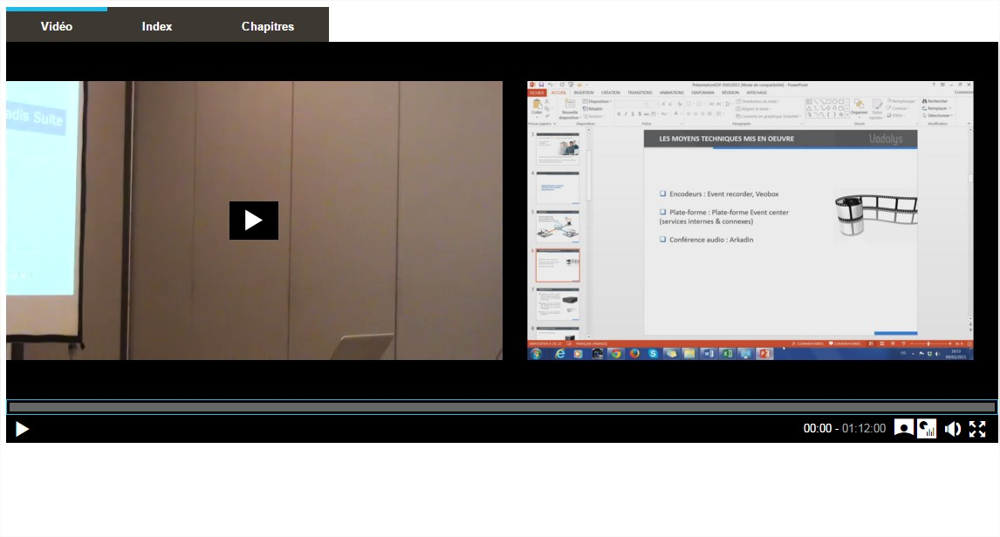

# What's OpenVeo Publish ?

OpenVeo Publish is an [OpenVeo](https://github.com/veo-labs/openveo-core) plugin.

OpenVeo Publish adds the following features :

- The possibility to upload videos, on local Openveo http server, [Vimeo](https://vimeo.com), [Youtube](https://www.youtube.com/) or [Wowza](https://www.wowza.com/), with synchronized images. ([Watcher](/watcher))
- Back end pages :
    - A page to manage the list of videos
    - A page to create and organize video categories
    - A page to create new video properties
    - A page to start / stop the watcher
    - A page to add chapters on a video or cut a video (begin / end)
    - A page to configure the plugin
- A public page to play a video with images synchronization and chapters

## Screenshots

### Back end catalogue

### Back end chapters

### Back end categories

### Back end video properties

### Back end watcher

### Public video with images synchronization
